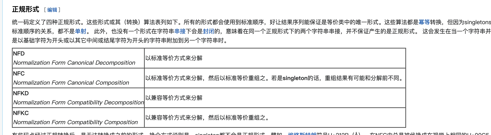

## HtmlExtractor

### 思路

```
可视宽度和高度怎么获取
如何获取在html中的位置
```

### DAG相关

```
http://qtdebug.com/topology/
https://jishuin.proginn.com/p/763bfbd65225
https://blog.atomicer.cn/2019/08/31/dag-in-action/
https://blog.csdn.net/a925907195/article/details/88258273
```

### 开发

```
借鉴GNE
文本聚类
word2vec
golang 加载python model （https://www.cnblogs.com/zhangchaoyang/articles/11363726.html）
```

### 设计模式

```
门面模式
```

### 概念

